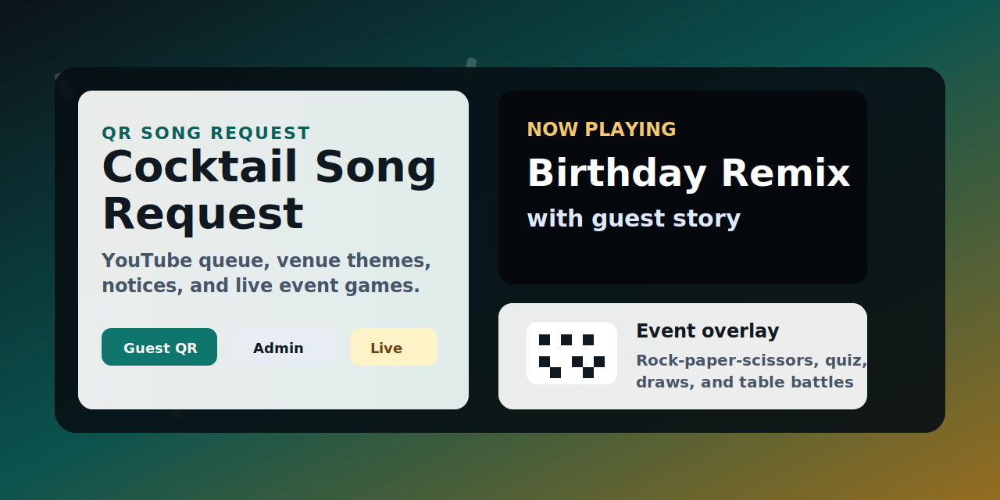

# 칵테일바 신청곡 시스템



대학생 술자리, 동아리 뒤풀이, 과모임, 칵테일바, 파티룸에서 바로 쓸 수 있는 QR 신청곡 + YouTube 재생 + 빔프로젝터 디스플레이 시스템입니다.

손님은 QR로 노래를 검색하고 사연과 테마를 남깁니다. 직원은 관리자 화면에서 신청곡을 승인하고, 매장 화면에는 현재 노래, 사연, 생일/환영 테마, 공지, 게임 이벤트가 자동으로 표시됩니다.

Node.js와 순수 HTML/CSS/JavaScript로 만든 작은 로컬 서버라 별도 DB 없이 바로 실행할 수 있습니다.

## 주요 기능

- 손님용 QR 신청 페이지: YouTube 노래 검색, 신청자, 사연, 화면 테마 선택
- 직원용 관리자 페이지: 신청곡 승인/거절, 대기열 관리, 현재 재생 제어
- 빔프로젝터/모니터용 디스플레이: 현재 곡, 사연, QR, 테마 효과, 이벤트 오버레이
- 생일, 동아리/모임, 학과/과모임, 새내기, 시험 끝, 커플/기념일, 송별/졸업, 직접 입력 테마
- 주방 마감/매장 공지 화면 표시와 음성 안내
- 사장님 가위바위보, 랜덤 추첨, 즉석 퀴즈, 테이블 대항전
- `data/state.json` 기반 로컬 상태 저장으로 작은 매장에서 간단히 운영 가능

## 화면 구성

| 손님 신청 페이지 | 직원 관리자 페이지 | 매장 디스플레이 |
| --- | --- | --- |
| 노래 검색, 사연 작성, 이벤트 참여 | 신청곡 승인, 공지, 게임 진행 | 현재 곡, 사연, QR, 이벤트 표시 |

## 빠른 실행

```bash
npm install
npm start
```

접속 주소:

- 손님 신청 페이지: `http://localhost:3000/request`
- 직원 관리자 페이지: `http://localhost:3000/admin`
- 빔프로젝터 디스플레이: `http://localhost:3000/display`

다른 포트로 실행:

```bash
PORT=3001 npm start
```

## 매장 운영 예시

1. 빔프로젝터나 TV에서 `/display`를 엽니다.
2. 브라우저 자동 재생 정책 때문에 처음 한 번 `시작하기`를 누릅니다.
3. 테이블, 메뉴판, 매장 화면에 QR을 안내합니다.
4. 직원은 노트북이나 태블릿에서 `/admin`을 켜둡니다.
5. 손님은 `/request`에서 노래를 검색하고 테마/사연을 남깁니다.
6. 직원이 승인하면 대기열에 들어가고, 재생 중인 곡은 디스플레이에 표시됩니다.

## 게임 이벤트

- **사장님 가위바위보**: 손님이 바위/가위/보를 선택하고, 직원이 사장님 선택을 입력해 승자를 발표합니다.
- **랜덤 추첨**: 참여자 중 한 명을 무작위로 뽑습니다.
- **즉석 퀴즈**: 직원이 문제와 정답을 설정하고, 정답자를 자동 판정합니다.
- **테이블 대항전**: 테이블/팀 단위로 참여하고 당첨 테이블을 발표합니다.

## 공지와 마감 안내

관리자 페이지에서 바로 공지를 띄울 수 있습니다. 주방 마감 시간도 설정할 수 있어, 지정된 시간에 “주방 주문 마감” 같은 안내를 화면과 음성으로 내보낼 수 있습니다.

## 데이터와 개인정보

런타임 데이터는 `data/state.json`에 저장됩니다. 이 파일은 `.gitignore`에 포함되어 있어 신청곡 기록, 사연, 참여자 정보가 공개 저장소에 올라가지 않습니다.

## 검증

```bash
npm run check
npm audit
```

## 추천 GitHub Topics

`song-request`, `qr-code`, `youtube`, `bar`, `karaoke`, `event-system`, `college`, `digital-signage`

## 라이선스

MIT
# Cocktail Song Request


QR song requests, YouTube playback, live display themes, store announcements, and small event games for cocktail bars, campus pubs, club parties, and private venues.

The app is built as a small Node.js server with plain HTML/CSS/JavaScript. No database is required for local operation.

## Highlights

- Guest QR page for song search, YouTube selection, request notes, and event participation
- Staff admin page for approving songs, controlling the queue, sending notices, and running games
- Projector display page with YouTube playback, current song, stories, QR code, and theme effects
- Campus-friendly themes for birthdays, clubs, departments, freshmen, exams, couples, farewell parties, and custom welcomes
- Scheduled kitchen-close notice with screen overlay and browser speech synthesis
- Event games: boss rock-paper-scissors, random draw, instant quiz, and table battle
- Local JSON state so a small venue can run it without external infrastructure

## Screens

| Guest request | Staff admin | Projector display |
| --- | --- | --- |
| Search YouTube and submit a song | Approve queue, notices, and games | Show current song, story, QR, event overlays |

## Quick Start

```bash
npm install
npm start
```

Open:

- Guest request page: `http://localhost:3000/request`
- Staff admin page: `http://localhost:3000/admin`
- Projector display page: `http://localhost:3000/display`

To use another port:

```bash
PORT=3001 npm start
```

## Typical Venue Setup

1. Open `/display` on the projector or TV.
2. Press "Start" once so the browser can play YouTube audio.
3. Put the QR code on tables, menus, or the screen.
4. Staff keeps `/admin` open on a laptop or tablet.
5. Guests open `/request`, search for a song, choose a theme, and submit a story.

## Event Games

- **Boss game**: guests choose rock, paper, or scissors; staff chooses the boss move and announces winners.
- **Random draw**: pick one participant from all entries.
- **Instant quiz**: staff sets a question and answer; matching answers win.
- **Table battle**: guests join by table/team; one table is selected as the winner.

## Operational Notices

Staff can send immediate screen notices from `/admin`. Kitchen close can be scheduled by time, including voice guidance on the display page after the display is unlocked.

## Data

Runtime state is stored in `data/state.json`. It is intentionally ignored by git so public repositories do not leak venue data, request history, or event participants.

## Validation

```bash
npm run check
npm audit
```

## Suggested GitHub Topics

`song-request`, `qr-code`, `youtube`, `bar`, `karaoke`, `event-system`, `college`, `digital-signage`

## License

MIT
